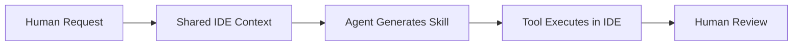

# 08｜Workflow 0｜Human Request → On-Demand Tool Generation

## 页面目标
展示一种高层最容易感知差异化的场景：人提出 studio-specific 需求，agent 临时生成工具或 skill 并在 IDE 中执行。

## 建议 Slidev 布局
- 推荐布局：workflow / left-to-right
- 风格关键词：深色、紫黑主调、游戏研发控制台、工程系统感、信息密度高但秩序清晰。
- 建议比例：16:9，尽量保持“左文右图”或“中心结构图 + 少量文案”的演讲风格。

## 主视觉提示词
水平流程图海报：需求卡片进入，共享 IDE 上下文被激活，agent 生成一个小工具模块，随后运行风险扫描/批处理/项目规则检查，最终人类审核结果。

## 信息图 / 结构图提示词
四步法：Prompt → Context → Skill → Review。每一步用不同形状卡片表示，像生产线。

## 页面文案提示词
- 场景示例 1：为某个 studio 的命名规范生成一次性检查器。
- 场景示例 2：在引擎升级前做项目特定的依赖与风险扫描。
- 场景示例 3：批量评估哪些改动会联动影响 Prefab、Scene 或 Blueprint。
- ROI：减少一次性脚本、手工插件与重复性人工分析。

## 可直接改写的 Slidev 草图
```md
---
layout: center
---

# Workflow 0
## Human Request → On-Demand Tool Generation


```

## 讲者备注
这一页可以说：过去我们要为每个特殊需求开发内部工具；未来，很多轻量工具会被 agent 在共享 IDE 上下文里即时生成。

## 事实锚点（不上屏，用于校正文案）
证据锚点：MCP Steroid 官网明确把“Create new skills”“No plugin development needed”作为能力说明；Junie 与 IDE 联动则代表官方路径下的共享上下文能力。
