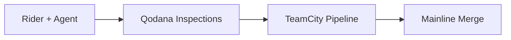

# 12｜Workflow 4｜Pre-Merge Quality Gate

## 页面目标
用一页说服研发管理：JetBrains 不只帮助“写”，更帮助“放行”。

## 建议 Slidev 布局
- 推荐布局：pipeline / gate
- 风格关键词：深色、紫黑主调、游戏研发控制台、工程系统感、信息密度高但秩序清晰。
- 建议比例：16:9，尽量保持“左文右图”或“中心结构图 + 少量文案”的演讲风格。

## 主视觉提示词
一条深色 CI/CD 管道，左侧是 Rider 与 agent 的改动，中央是 Qodana 质量门禁，右侧是 TeamCity pipeline 与主干仓库。红绿灯式 gate 很醒目。

## 信息图 / 结构图提示词
IDE → Agent → Qodana → TeamCity → Merge 五节点，Qodana 节点做成闸门形状。

## 页面文案提示词
- 开发期：Rider inspections 先在本地发现问题。
- 团队期：Qodana 把相同的语义规则带入 CI。
- 交付期：TeamCity 承接游戏研发流水线与主干反馈。
- 管理价值：把“AI 生成代码”转成“可验证的入仓质量”。

## 可直接改写的 Slidev 草图
```md
---
layout: center
---

# Workflow 4
## Pre-Merge Quality Gate


```

## 讲者备注
这页最适合对 CTO 说：未来最值钱的不是把 20% 的代码交给 agent 写，而是敢把 20% 的 agent 改动放入主干。

## 事实锚点（不上屏，用于校正文案）
证据锚点：Qodana 官方说明其把 JetBrains IDE inspections 带入 CI；Qodana 使用原生 JetBrains inspections 和 profiles；TeamCity 官方游戏开发页强调对 Perforce Helix、Unity、Unreal 等集成，且 Qodana 在 TeamCity 中作为 build runner 可用。
