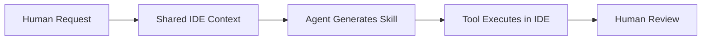

# 01｜封面｜Rider as the Shared IDE for Humans and Agents

## 页面目标
一句话定调：JetBrains Rider 不是“另一个 AI IDE”，而是 Agentic Game Development 的共享工程工作台。让观众在第一页就接受“共享 IDE / 共享上下文 / 共享控制面”的叙事。

## 建议 Slidev 布局
- 推荐布局：cover / hero / 左文右图
- 风格关键词：深色、紫黑主调、游戏研发控制台、工程系统感、信息密度高但秩序清晰。
- 建议比例：16:9，尽量保持“左文右图”或“中心结构图 + 少量文案”的演讲风格。

## 主视觉提示词
深色电影感游戏研发控制室，主屏是代码编辑器与游戏引擎视窗并置，屏幕周围漂浮多个 agent 节点与任务卡片，人类开发者坐在前景侧身操作，紫黑色主调，电蓝高光，精密 UI overlays，future software production system, premium keynote hero, no logos, ultra wide composition

## 信息图 / 结构图提示词
做一条细长底部信息带：Human Workspace / Agent Runtime / Quality & Governance Plane 三段式，像系统架构启动条一样从左到右点亮。

## 页面文案提示词
- 主标题：JetBrains for Agentic-Driven Game Development
- 副标题：Why Rider Becomes the Shared IDE for Humans and Agents
- 页面一句话：从“给人用的 IDE”进化为“人类与 agent 共用的工程工作台”。
- 角落小字：Rider · dotUltimate · Junie · Qodana · TeamCity · AI Enterprise

## 可直接改写的 Slidev 草图
```md
---
layout: cover
class: text-left
---

# JetBrains for Agentic-Driven Game Development
## Why Rider Becomes the Shared IDE for Humans and Agents

<div class="mt-8 text-sm opacity-80">
从“给人用的 IDE”进化为“人类与 agent 共用的工程工作台”
</div>
```

## 讲者备注
讲的时候不要从功能开始，要从范式变化开始：未来争夺的不是聊天框，而是谁控制人类与 agent 共同生产软件的上下文、执行与验证链路。

## 事实锚点（不上屏，用于校正文案）
证据锚点：Rider 被 JetBrains 官方定位为 .NET 与 game development IDE；dotUltimate 作为 .NET 与 game development 工具包包含 Rider、ReSharper、ReSharper C++、dotTrace、dotMemory、dotCover、dotPeek、AI Pro。


---

# 02｜Executive Thesis｜稀缺资源从“生成”转向“上下文与控制”

## 页面目标
用管理层语言定义问题：AI 时代真正稀缺的不是生成速度，而是引擎语义、项目上下文、入仓质量与治理。

## 建议 Slidev 布局
- 推荐布局：statement / split / 左大论点右视觉
- 风格关键词：深色、紫黑主调、游戏研发控制台、工程系统感、信息密度高但秩序清晰。
- 建议比例：16:9，尽量保持“左文右图”或“中心结构图 + 少量文案”的演讲风格。

## 主视觉提示词
左右对比构图，左侧是廉价 file-only AI workflow：散落文件、红色警告、broken build；右侧是 system-aware workflow：IDE semantic graph、tests、quality gate、agent orchestration。整体像咨询公司高管演示图，克制、冷静、可信。

## 信息图 / 结构图提示词
中间用一个三层漏斗：Code Generation 在上层很宽，Project Context 在中层收窄，Quality & Governance 在底层最稀缺且价值最高。

## 页面文案提示词
- 结论句：在 Agentic GameDev 里，最值钱的不是“更快写出来”，而是“在真实工程约束下写对、测过、放得进主干”。
- 支撑点 1：GameDev 不是单文件写作，而是代码、引擎、资产、流程的系统协作。
- 支撑点 2：越往主干与发布靠近，验证、治理与责任链越重要。
- 支撑点 3：因此，Rider 的价值不止于 IDE，而是共享上下文与控制面。

## 可直接改写的 Slidev 草图
```md
---
layout: two-cols-header
---

# Executive Thesis

::left::
- 最稀缺的不是生成，而是上下文与控制
- 最昂贵的不是写代码，而是改对代码
- 最关键的不是 AI 聊天，而是可验证地入仓

::right::
<HeroVisual />
```

## 讲者备注
这页最好用一句管理层能复述的话收束：AI 让写代码更便宜，反而让上下文、质量门禁和治理更贵。

## 事实锚点（不上屏，用于校正文案）
证据锚点：Qodana 官方定位是把 JetBrains IDE inspections 带入 CI；AI Enterprise 官方强调对 security、spending、legal compliance 的控制。


---

# 03｜Why Generic AI Breaks in GameDev｜通用 AI 为何在游戏研发里失真

## 页面目标
让观众承认：GameDev 对 AI 的难度不在“写代码”，而在“理解引擎、资产、工具链与性能后果”。

## 建议 Slidev 布局
- 推荐布局：problem / four-quadrant
- 风格关键词：深色、紫黑主调、游戏研发控制台、工程系统感、信息密度高但秩序清晰。
- 建议比例：16:9，尽量保持“左文右图”或“中心结构图 + 少量文案”的演讲风格。

## 主视觉提示词
四象限信息海报：Unreal 宏与 Blueprints、Unity Prefab/Scene/Shader、Perforce changelist 与 shelve、性能与内存回归曲线。整体像工程风险雷达图，深色背景，带红橙风险标记。

## 信息图 / 结构图提示词
做一个“File View → Project View → Engine View → Delivery View”四级放大镜，每一级暴露新的复杂性。

## 页面文案提示词
- 症状：只会读写文件的 AI，看不到 Blueprint、Prefab、Scene、构建图和性能回归。
- 结果：它能产出代码，但不一定能产出可上线的游戏改动。
- 结论：GameDev 需要的是 system-aware AI，而不是 file-only AI。
- 过桥句：这正是 Rider 这类 IDE-native 能力的价值起点。

## 可直接改写的 Slidev 草图
```md
---
layout: default
---

# Why Generic AI Breaks in GameDev

- Unreal: 宏、Reflection、Blueprints
- Unity: Prefab、Scene、Shader、Tests、Profiler
- Perforce: Changelist、Shelve、锁文件流程
- Shipping: Build、Quality Gate、性能与内存回归
```

## 讲者备注
讲解时不要贬低通用 AI，而是指出它默认优化的是“通用编程任务”，而游戏公司需要的是“引擎化、资产化、流水线化”的工程语境。

## 事实锚点（不上屏，用于校正文案）
证据锚点：Rider 官方对 Unreal 强调对宏、Blueprint、build files 的理解；对 Unity 强调 quick-fixes、tests、profiling、shader、assets；TeamCity 官方强调 Perforce Helix、Unity、Unreal 等游戏开发集成。


---

# 04｜The JetBrains Stack｜从个人 IDE 到组织级生产基础设施

## 页面目标
给出全景架构图，让高层看到这不是单点工具，而是完整的生产层级。

## 建议 Slidev 布局
- 推荐布局：architecture / layered
- 风格关键词：深色、紫黑主调、游戏研发控制台、工程系统感、信息密度高但秩序清晰。
- 建议比例：16:9，尽量保持“左文右图”或“中心结构图 + 少量文案”的演讲风格。

## 主视觉提示词
层级式软件架构图，四层堆栈悬浮在深色背景上：Human Workspace、Agent Access Layer、Quality Delivery Layer、Governance Layer，每层用不同亮度的紫蓝色发光面板表示。

## 信息图 / 结构图提示词
四层架构建议：1) Rider / ReSharper / ReSharper C++；2) Junie / ACP / MCP Server；3) Qodana / TeamCity / YouTrack；4) AI Enterprise。右侧加一根纵向说明：dotUltimate = developer toolkit。

## 页面文案提示词
- Human Workspace：Rider 负责高保真编码、理解、调试与复核。
- Agent Access Layer：Junie、ACP、MCP 让 agent 进入同一工程上下文。
- Quality Delivery Layer：Qodana、TeamCity、YouTrack 把语义规则延伸到团队工作流。
- Governance Layer：AI Enterprise 负责预算、权限、模型与合规控制。

## 可直接改写的 Slidev 草图
```md
            ---
            layout: center
            ---

            # The JetBrains Stack

            ```mermaid
            flowchart TB
              A[Human Workspace
Rider / ReSharper / ReSharper C++] --> B[Agent Access Layer
Junie / ACP / MCP Server]
              B --> C[Quality Delivery Layer
Qodana / TeamCity / YouTrack]
              C --> D[Governance Layer
AI Enterprise]
            ```
            ```

## 讲者备注
这一页的关键词是“分层”，不是“产品罗列”。让听众看到：JetBrains 已经覆盖从个人开发到团队交付再到组织治理。

## 事实锚点（不上屏，用于校正文案）
证据锚点：Rider 2026.1 带来 ACP Registry；Rider 2025.2 起集成 MCP Server；Junie CLI 可连接运行中的 IDE；Qodana 用原生 JetBrains inspections 和 profiles；AI Enterprise 提供 security、spending、legal compliance 控制。


---

# 05｜Rider = Shared IDE for Human + Agent｜共享 IDE 的定义

## 页面目标
把“共享 IDE”这个概念讲清楚：不是 agent 替代人，而是双方复用同一份工程上下文和工具链。

## 建议 Slidev 布局
- 推荐布局：concept / hub-and-spoke
- 风格关键词：深色、紫黑主调、游戏研发控制台、工程系统感、信息密度高但秩序清晰。
- 建议比例：16:9，尽量保持“左文右图”或“中心结构图 + 少量文案”的演讲风格。

## 主视觉提示词
中心是一台打开的 IDE，左右各一只手：左边人类开发者，右边半透明 agent 形象。两边都通过同样的索引、语义分析、build/test 配置、debugger、VCS 工具接入中心。

## 信息图 / 结构图提示词
hub-and-spoke 图：中间 Rider，外圈节点包括 Indexing、Semantic Analysis、Refactoring、Tests、Debugger、Perforce、Engine Context。Human 与 Agent 都接到中间。

## 页面文案提示词
- Shared Context：人和 agent 看到的是同一份项目语义，不是各自猜测。
- Shared Tooling：重构、测试、调试、版本控制都来自同一套 IDE 基建。
- Shared Control：敏感动作可审、可停、可回退，人类仍然掌握放行权。

## 可直接改写的 Slidev 草图
```md
---
layout: image-right
---

# Rider = Shared IDE for Human + Agent

- Shared context
- Shared tooling
- Shared control

<div class="mt-6 opacity-80">人和 agent 共用同一工程工作台，而不是各自持有一个割裂的上下文副本。</div>
```

## 讲者备注
强调“共享”两字。真正的差异不在于能否接入 agent，而在于 agent 是否复用了 IDE 的真实上下文和工具链。

## 事实锚点（不上屏，用于校正文案）
证据锚点：Junie CLI 官方称可连接运行中的 JetBrains IDE，复用 indexing、semantic analysis 以及已有 build/test 配置；Rider 的 MCP Server 允许外部客户端访问 IDE 提供的工具。


---

# 06｜Official Path｜ACP + Built-in MCP + Junie

## 页面目标
把正式主产品路径讲成可落地能力，而不是实验性概念。

## 建议 Slidev 布局
- 推荐布局：timeline / three-lane
- 风格关键词：深色、紫黑主调、游戏研发控制台、工程系统感、信息密度高但秩序清晰。
- 建议比例：16:9，尽量保持“左文右图”或“中心结构图 + 少量文案”的演讲风格。

## 主视觉提示词
三条发光轨道并行：ACP Registry（发现与接入 agent）、MCP Server（外部客户端调用 IDE 工具）、Junie（在 IDE/终端/CI 中执行多步任务）。三轨最终汇聚到 Rider。

## 信息图 / 结构图提示词
用一个三泳道图：Discover agents / Connect tools / Execute tasks。每条泳道配一句简洁解释。

## 页面文案提示词
- ACP Registry：让团队在 IDE 里发现并接入 agent，不被单一供应商绑定。
- Built-in MCP Server：让 Claude、Cursor、Codex、VS Code 等外部客户端直接调用 IDE 工具。
- Junie：让 agent 能计划并执行复杂多步任务，并运行测试或终端命令。

## 可直接改写的 Slidev 草图
```md
---
layout: two-cols-header
---

# Official Path

::left::
- ACP Registry：接入更多 agent
- Built-in MCP Server：向外暴露 IDE 工具
- Junie：执行复杂多步任务

::right::
<ThreeLaneDiagram />
```

## 讲者备注
这页不要混入 MCP Steroid。要明确：这里讲的是 JetBrains 官方主干能力，是能采购、能推广、能治理的能力。

## 事实锚点（不上屏，用于校正文案）
证据锚点：Rider 2026.1 官方新特性包含 built-in ACP Registry；Rider 文档说明 2025.2 起内置 MCP Server；Junie 文档说明其可规划并执行复杂多步任务、运行测试或终端命令。


---

# 07｜Frontier Path｜MCP Steroid as Skill Factory

## 页面目标
把 MCP Steroid 放在“前沿能力”位置，展示 JetBrains 路线的上限，同时清楚标注其研究性质。

## 建议 Slidev 布局
- 推荐布局：vision / spotlight
- 风格关键词：深色、紫黑主调、游戏研发控制台、工程系统感、信息密度高但秩序清晰。
- 建议比例：16:9，尽量保持“左文右图”或“中心结构图 + 少量文案”的演讲风格。

## 主视觉提示词
一个未来感工具工坊：agent 在 IDE 内锻造新的技能模块，模块表面印着 refactor、inspect、debug、test、UI capture。中央悬浮文字：Give AI the whole IDE, not just the files. 视觉偏概念海报。

## 信息图 / 结构图提示词
三段式：Human asks → Agent generates a skill → IDE runtime executes it。顶部加醒目的小标签：Frontier / Independent Research Project。

## 页面文案提示词
- 核心概念：不只是让 agent 用 IDE，而是让 IDE 成为 agent 的 skill factory。
- 价值：按 studio-specific 需求临时长出工具，而不是每次都走完整插件开发流程。
- 边界：这是前沿方向，不是本 deck 的核心商业承诺。

## 可直接改写的 Slidev 草图
```md
---
layout: statement
---

# Frontier Path
## MCP Steroid as Skill Factory

> Give AI the whole IDE, not just the files.

- Human asks
- Agent generates a skill
- IDE runtime executes it
```

## 讲者备注
务必口头强调独立研究项目属性。用途是拉开想象力上限，不是替代官方主路径。

## 事实锚点（不上屏，用于校正文案）
证据锚点：MCP Steroid 官网称其向 agent 暴露 IDE APIs、visual state、runtime environment，并声称在选定任务上可让 agent 提速 20–54%；JetBrains Marketplace 明确标注它是 Eugene Petrenko 的 independent research project，非 JetBrains 官方支持产品。


---

# 08｜Workflow 0｜Human Request → On-Demand Tool Generation

## 页面目标
展示一种高层最容易感知差异化的场景：人提出 studio-specific 需求，agent 临时生成工具或 skill 并在 IDE 中执行。

## 建议 Slidev 布局
- 推荐布局：workflow / left-to-right
- 风格关键词：深色、紫黑主调、游戏研发控制台、工程系统感、信息密度高但秩序清晰。
- 建议比例：16:9，尽量保持“左文右图”或“中心结构图 + 少量文案”的演讲风格。

## 主视觉提示词
水平流程图海报：需求卡片进入，共享 IDE 上下文被激活，agent 生成一个小工具模块，随后运行风险扫描/批处理/项目规则检查，最终人类审核结果。

## 信息图 / 结构图提示词
四步法：Prompt → Context → Skill → Review。每一步用不同形状卡片表示，像生产线。

## 页面文案提示词
- 场景示例 1：为某个 studio 的命名规范生成一次性检查器。
- 场景示例 2：在引擎升级前做项目特定的依赖与风险扫描。
- 场景示例 3：批量评估哪些改动会联动影响 Prefab、Scene 或 Blueprint。
- ROI：减少一次性脚本、手工插件与重复性人工分析。

## 可直接改写的 Slidev 草图
```md
---
layout: center
---

# Workflow 0
## Human Request → On-Demand Tool Generation


```

## 讲者备注
这一页可以说：过去我们要为每个特殊需求开发内部工具；未来，很多轻量工具会被 agent 在共享 IDE 上下文里即时生成。

## 事实锚点（不上屏，用于校正文案）
证据锚点：MCP Steroid 官网明确把“Create new skills”“No plugin development needed”作为能力说明；Junie 与 IDE 联动则代表官方路径下的共享上下文能力。


---

# 09｜Workflow 1｜Issue → Impact Analysis → Plan

## 页面目标
说明 JetBrains 生态如何把“需求/问题”与“代码影响面分析”连接起来，而不是让 agent 直接盲写。

## 建议 Slidev 布局
- 推荐布局：workflow / issue-to-code
- 风格关键词：深色、紫黑主调、游戏研发控制台、工程系统感、信息密度高但秩序清晰。
- 建议比例：16:9，尽量保持“左文右图”或“中心结构图 + 少量文案”的演讲风格。

## 主视觉提示词
左侧是 YouTrack issue 卡片，中央是 Rider 中的符号导航、依赖图和值流分析，右侧是 agent 生成的实现计划与验证清单。

## 信息图 / 结构图提示词
用三节点漏斗：Issue / Impact Analysis / Implementation Plan。给中间节点高亮，因为这是通用 AI 最薄弱的一环。

## 页面文案提示词
- 输入：新玩法需求、线上 bug、引擎升级任务。
- 中段：先做影响面分析，而不是立即动手生成代码。
- 输出：可评审的实施计划、改动范围、验证策略与风险点。
- 价值：减少方案返工与误判波及面。

## 可直接改写的 Slidev 草图
```md
---
layout: two-cols
---

# Workflow 1
## Issue → Impact Analysis → Plan

::left::
- 输入：需求 / 缺陷 / 升级任务
- 中段：影响面分析
- 输出：计划 + 风险 + 验证清单

::right::
<IssueToPlanFlow />
```

## 讲者备注
建议强调：真正专业的 agentic workflow，第一步不是 coding，而是 understanding。

## 事实锚点（不上屏，用于校正文案）
证据锚点：YouTrack 可与版本控制关联 issue、commit 与分支；Rider 提供项目级分析与依赖探索。


---

# 10｜Workflow 2｜Gameplay / Feature Implementation

## 页面目标
把 JetBrains 在 Unity、Unreal、Godot 三条路径上的引擎化上下文优势讲清楚。

## 建议 Slidev 布局
- 推荐布局：three-columns / engine-aware
- 风格关键词：深色、紫黑主调、游戏研发控制台、工程系统感、信息密度高但秩序清晰。
- 建议比例：16:9，尽量保持“左文右图”或“中心结构图 + 少量文案”的演讲风格。

## 主视觉提示词
三联屏海报：左 Unity（Prefab/Scene/Shader/Test/Profiler），中 Unreal（Reflection/Blueprint/Debugger/Test），右 Godot（C# + GDScript）。每栏都有 IDE 与引擎视窗的组合。

## 信息图 / 结构图提示词
三列卡片，每列四个关键词，底部统一一条结论：Engine-aware context makes AI useful, not just available.

## 页面文案提示词
- Unity：quick-fixes、tests、profiling、shader、assets workflow。
- Unreal：宏、Reflection、Blueprint insight、调试与测试。
- Godot：C# 与 GDScript 双栈的一致工作台。
- 结论：Rider 不是 generic editor，而是 engine-aware workspace。

## 可直接改写的 Slidev 草图
```md
---
layout: three-cols
---

# Workflow 2
## Gameplay / Feature Implementation

::col1::
### Unity
- quick-fixes
- tests
- profiling
- shaders

::col2::
### Unreal
- reflection
- Blueprints
- debugger
- tests

::col3::
### Godot
- C#
- GDScript
- navigation
- debugging
```

## 讲者备注
这页要多用“不是任何 LLM 都有的上下文”这句，但不要抽象讲，要具体落到 prefab、Blueprint、shader、tests 上。

## 事实锚点（不上屏，用于校正文案）
证据锚点：Unity 文档明确列出 quick-fixes、inspections、Unity tests、profiling、shader 支持；Unreal 落地页与文档强调 Blueprints、macros、Reflection、debugger、Automation Tests；Godot 由 Rider 官方游戏开发文档覆盖。


---

# 11｜Workflow 3｜Refactor / Engine Upgrade / API Migration

## 页面目标
让观众理解：AI 给速度，Rider 给安全边界；真正值钱的是安全迁移而不是表面生成。

## 建议 Slidev 布局
- 推荐布局：problem-solution / surgery metaphor
- 风格关键词：深色、紫黑主调、游戏研发控制台、工程系统感、信息密度高但秩序清晰。
- 建议比例：16:9，尽量保持“左文右图”或“中心结构图 + 少量文案”的演讲风格。

## 主视觉提示词
高精度手术室视觉隐喻：dependency graph 像血管网络，refactoring 像外科手术，风险点以红色光点标出。中央叠加 IDE 安全重构提示。

## 信息图 / 结构图提示词
三段式：Generate → Analyze → Safely Apply。把“Analyze / Safely Apply”画得更粗更重。

## 页面文案提示词
- AI 擅长起草迁移与大改动初稿。
- Rider 擅长 solution-wide 分析、依赖图、冲突预览与安全重构。
- 对大型游戏工程来说，迁移速度重要，但迁移后 defect leakage 更重要。

## 可直接改写的 Slidev 草图
```md
---
layout: image-left
---

# Workflow 3
## Refactor / Engine Upgrade / API Migration

- Generate the first draft fast
- Analyze whole-project impact
- Apply refactorings safely
- Review before merge
```

## 讲者备注
建议举一个具象例子：从批量 rename 到跨项目 change signature，再到引擎升级时的兼容性调整。

## 事实锚点（不上屏，用于校正文案）
证据锚点：Rider 官方强调原生支持 Unreal project model，使 refactorings 与 quick-fixes 更新 Blueprints、metadata、build files；ReSharper C++ 官方强调其对 Unreal 机制与代码模式的独特理解。


---

# 12｜Workflow 4｜Pre-Merge Quality Gate

## 页面目标
用一页说服研发管理：JetBrains 不只帮助“写”，更帮助“放行”。

## 建议 Slidev 布局
- 推荐布局：pipeline / gate
- 风格关键词：深色、紫黑主调、游戏研发控制台、工程系统感、信息密度高但秩序清晰。
- 建议比例：16:9，尽量保持“左文右图”或“中心结构图 + 少量文案”的演讲风格。

## 主视觉提示词
一条深色 CI/CD 管道，左侧是 Rider 与 agent 的改动，中央是 Qodana 质量门禁，右侧是 TeamCity pipeline 与主干仓库。红绿灯式 gate 很醒目。

## 信息图 / 结构图提示词
IDE → Agent → Qodana → TeamCity → Merge 五节点，Qodana 节点做成闸门形状。

## 页面文案提示词
- 开发期：Rider inspections 先在本地发现问题。
- 团队期：Qodana 把相同的语义规则带入 CI。
- 交付期：TeamCity 承接游戏研发流水线与主干反馈。
- 管理价值：把“AI 生成代码”转成“可验证的入仓质量”。

## 可直接改写的 Slidev 草图
```md
---
layout: center
---

# Workflow 4
## Pre-Merge Quality Gate


```

## 讲者备注
这页最适合对 CTO 说：未来最值钱的不是把 20% 的代码交给 agent 写，而是敢把 20% 的 agent 改动放入主干。

## 事实锚点（不上屏，用于校正文案）
证据锚点：Qodana 官方说明其把 JetBrains IDE inspections 带入 CI；Qodana 使用原生 JetBrains inspections 和 profiles；TeamCity 官方游戏开发页强调对 Perforce Helix、Unity、Unreal 等集成，且 Qodana 在 TeamCity 中作为 build runner 可用。


---

# 13｜Workflow 5｜Performance / Memory / Regression Triage

## 页面目标
把 deck 从“AI coding”拉高到“游戏体验与运行质量”。

## 建议 Slidev 布局
- 推荐布局：observability / dashboard
- 风格关键词：深色、紫黑主调、游戏研发控制台、工程系统感、信息密度高但秩序清晰。
- 建议比例：16:9，尽量保持“左文右图”或“中心结构图 + 少量文案”的演讲风格。

## 主视觉提示词
游戏性能分析控制台：帧时间图、CPU flame chart、memory snapshot、GC spike、call stack，旁边是 Rider/dotTrace/dotMemory 风格的分析面板。

## 信息图 / 结构图提示词
三层仪表盘：Frame Time / Memory / Test Coverage。每层都标注“发现 → 定位 → 修复 → 回归验证”。

## 页面文案提示词
- 游戏研发里，最贵的常常不是“写功能”，而是“修体验”。
- Rider + dotTrace + dotMemory + dotCover 把性能、内存、覆盖率拉进同一套开发工作台。
- 在 agentic workflow 中，分析与复核仍然需要专业工具而不是纯对话界面。

## 可直接改写的 Slidev 草图
```md
---
layout: image-right
---

# Workflow 5
## Performance / Memory / Regression Triage

- dotTrace：性能瓶颈与热点
- dotMemory：内存问题定位
- dotCover：覆盖率与回归保障
```

## 讲者备注
如果面对的是游戏 CTO 或引擎负责人，这页权重可以再升高，因为它直接把 IDE 价值从“写代码”延伸到“保体验”。

## 事实锚点（不上屏，用于校正文案）
证据锚点：dotUltimate 官方包含 dotTrace、dotMemory、dotCover；Rider 2026.1 官方博客提到 Unity Profiler integration；Unity 文档列出 profiling Unity games、Unity Profiler assistance 和 dotCover 集成。


---

# 14｜Role Map｜谁先采用，谁感知价值，谁来采购

## 页面目标
把“流程线”切换到“角色线”，让高层知道这不是只对程序员有意义。

## 建议 Slidev 布局
- 推荐布局：org-map / concentric circles
- 风格关键词：深色、紫黑主调、游戏研发控制台、工程系统感、信息密度高但秩序清晰。
- 建议比例：16:9，尽量保持“左文右图”或“中心结构图 + 少量文案”的演讲风格。

## 主视觉提示词
组织地图信息图：中心是一线高频用户，外圈是流程管理角色，最外圈是采购与治理角色。每个角色用简洁图标表示。

## 信息图 / 结构图提示词
同心圆：Core Users（Gameplay / Engine / Tools / Tech Art）→ Process Owners（QA / Build / Leads）→ Decision Makers（R&D Manager / CTO）。

## 页面文案提示词
- 一线角色追求更短的实现与调试闭环。
- 平台与流程角色追求更稳定的主干与更快的反馈。
- 管理层追求工具链收敛、标准化与 AI 治理。

## 可直接改写的 Slidev 草图
```md
---
layout: center
---

# Role Map

Core Users → Process Owners → Decision Makers
```

## 讲者备注
这页是后面角色页的导航，不要堆细节，只要让观众知道：每类角色看到的价值不同。

## 事实锚点（不上屏，用于校正文案）
证据锚点：Rider for Unreal 页面明确覆盖 Gameplay Developer、Engine Developer、Technical Artist 等角色；dotUltimate 面向 .NET 与 game development 团队工具包。


---

# 15｜角色 1｜Gameplay Programmer + Technical Artist

## 页面目标
把最容易感知“效率提升”的两个角色放在一起，形成 demo 友好页。

## 建议 Slidev 布局
- 推荐布局：persona split / left-right
- 风格关键词：深色、紫黑主调、游戏研发控制台、工程系统感、信息密度高但秩序清晰。
- 建议比例：16:9，尽量保持“左文右图”或“中心结构图 + 少量文案”的演讲风格。

## 主视觉提示词
左边玩法程序员在 Rider 中迭代 gameplay logic、tests、debugging；右边技术美术在 shader、材质、渲染调试界面中工作。整体像双职业海报。

## 信息图 / 结构图提示词
左右双卡：角色职责 / Rider + AI 如何提效 / 最适合 demo 的场景。

## 页面文案提示词
- Gameplay Programmer：更快实现玩法、调试脚本、验证行为、迭代局部重构。
- Technical Artist：更快处理 shader、材质、渲染相关脚本与问题定位。
- 共同点：他们都需要“懂引擎上下文”的 AI，而不是泛化聊天助手。

## 可直接改写的 Slidev 草图
```md
---
layout: two-cols
---

# Gameplay Programmer + Technical Artist

::left::
### Gameplay Programmer
- 实现更快
- 调试更稳
- 验证更短

::right::
### Technical Artist
- Shader / 材质支持
- 引擎内上下文
- 可视问题更快定位
```

## 讲者备注
这页建议配一个 Unity 或 Unreal shader / test / debug 的实操演示预告。

## 事实锚点（不上屏，用于校正文案）
证据锚点：Unity 文档明确写到 shader files 语法高亮、debugging Unity scripts、running and debugging Unity tests、profiling Unity games；Rider for Unreal 页面列出 Shaders development 及语义与 control-flow analysis。


---

# 16｜角色 2｜Engine / Framework / Rendering Engineer

## 页面目标
强调专业游戏开发工具真正的护城河在这类角色身上最明显。

## 建议 Slidev 布局
- 推荐布局：deep-tech / x-ray
- 风格关键词：深色、紫黑主调、游戏研发控制台、工程系统感、信息密度高但秩序清晰。
- 建议比例：16:9，尽量保持“左文右图”或“中心结构图 + 少量文案”的演讲风格。

## 主视觉提示词
工程系统 X 光图：大型代码库的依赖网络、渲染模块、引擎层组件、宏与构建文件被半透明展示出来，像看一台复杂机器的内部。

## 信息图 / 结构图提示词
三段竖卡：全局视图 / 安全重构 / 引擎语义。每段配 2–3 个关键词。

## 页面文案提示词
- 这类角色不缺补全，缺的是项目全局视图、依赖透明度与安全重构能力。
- Rider / ReSharper C++ 的价值在于：看清复杂系统，再安全地改它。
- 对 agent 来说，最难替代的也正是这些全局语义与工程边界判断。

## 可直接改写的 Slidev 草图
```md
---
layout: image-left
---

# Engine / Framework / Rendering Engineer

- Global architecture visibility
- Safe refactoring at scale
- Engine-aware semantic understanding
```

## 讲者备注
面对资深工程师时，要把“AI 提效”替换成“降低复杂系统变更风险”。这更能打动他们。

## 事实锚点（不上屏，用于校正文案）
证据锚点：Rider for Unreal 强调 project-wide code analysis、refactorings、macro/Blueprint/build file awareness；ReSharper C++ 官方强调对 Unreal-specific mechanisms and code patterns 的独特理解。


---

# 17｜角色 3｜Studio Tools / AI Platform / QA / Build & Release

## 页面目标
把平台团队与交付团队拉入同一页，证明 JetBrains 价值不止于编程器。

## 建议 Slidev 布局
- 推荐布局：platform / control-room
- 风格关键词：深色、紫黑主调、游戏研发控制台、工程系统感、信息密度高但秩序清晰。
- 建议比例：16:9，尽量保持“左文右图”或“中心结构图 + 少量文案”的演讲风格。

## 主视觉提示词
平台控制室视觉：一侧是 Studio Tools 工程师构建内部工具与 agent skills，另一侧是 QA 与 Build/Release 监控流水线、质量门禁与回归状态。

## 信息图 / 结构图提示词
四格：Studio Tools / AI Platform / QA / Build & Release，每格写 2 条可感知收益。

## 页面文案提示词
- Studio Tools / AI Platform：把 Rider 变成内部 agent 与技能的承载底座。
- QA：把测试、覆盖率、静态分析和回归验证拉进同一链路。
- Build & Release：让 TeamCity、Qodana、VCS 形成稳定的 pre-merge 与 release 系统。

## 可直接改写的 Slidev 草图
```md
---
layout: default
---

# Studio Tools / AI Platform / QA / Build & Release

- 平台团队：沉淀 studio-specific skills
- QA：把验证自动化前移
- Build & Release：缩短反馈回路，保护主干稳定
```

## 讲者备注
这页最重要的一句话：JetBrains 不是只卖给 coder，而是在卖给 studio 的工程平台团队。

## 事实锚点（不上屏，用于校正文案）
证据锚点：TeamCity 官方游戏开发页强调复杂 pipelines、Perforce Helix、Unity/Unreal 集成、实时反馈与 test analysis；Qodana/TeamCity 集成官方存在 build runner。


---

# 18｜角色 4｜R&D Management / CTO

## 页面目标
把购买逻辑抽象成高层最关心的四个结果：标准化、质量、治理、可观测。

## 建议 Slidev 布局
- 推荐布局：executive / dashboard
- 风格关键词：深色、紫黑主调、游戏研发控制台、工程系统感、信息密度高但秩序清晰。
- 建议比例：16:9，尽量保持“左文右图”或“中心结构图 + 少量文案”的演讲风格。

## 主视觉提示词
高管视角仪表盘：工具链收敛率、mainline breakage、AI spend、quality gate pass rate、lead time 等指标作为悬浮卡片围绕中心战略图。

## 信息图 / 结构图提示词
做一个四象限：Standardization / Quality / Governance / Visibility。每象限 2 个关键词。

## 页面文案提示词
- 高层买的不是一个 seat，而是一套组织级的软件生产控制面。
- 采购单元：dotUltimate。
- 组织收益：统一工具链、统一质量规则、统一 AI 治理、统一指标口径。

## 可直接改写的 Slidev 草图
```md
---
layout: statement
---

# R&D Management / CTO

> 高层买的不是一个 IDE seat，而是一套组织级的软件生产控制面。

- Standardization
- Quality
- Governance
- Visibility
```

## 讲者备注
如果你的听众是 VP/CTO，这页可以再补一句：dotUltimate 解决 seat 采购，JetBrains 生态解决平台标准化。

## 事实锚点（不上屏，用于校正文案）
证据锚点：dotUltimate 官方强调 single subscription 提供 Rider、ReSharper、AI Pro、dotTrace、dotMemory、dotCover 等；AI Enterprise 官方强调 security、spending、legal compliance 控制。


---

# 19｜Semantic Context Moat｜Rider 对 AI 的真正赋能

## 页面目标
深入浅出解释 flow analysis、dependency graph、refactoring safety，为何它们不是任何 LLM 都能替代的。

## 建议 Slidev 布局
- 推荐布局：moat / layered comparison
- 风格关键词：深色、紫黑主调、游戏研发控制台、工程系统感、信息密度高但秩序清晰。
- 建议比例：16:9，尽量保持“左文右图”或“中心结构图 + 少量文案”的演讲风格。

## 主视觉提示词
一个多层剖面图：最表层是 token 文本，中层是 symbols / PSI / AST，下一层是 dependency graph 与 project model，最深层是 runtime、tests、debugger、quality gate。像技术护城河剖面。

## 信息图 / 结构图提示词
左边 Token View，右边 System View。把 Flow Analysis、Dependency Graph、Refactoring Safety 放在 System View 下方。

## 页面文案提示词
- Flow / Value Analysis：沿真实执行路径理解值从哪里来、流到哪里去、哪里会出错。
- Dependency Graph：把项目依赖与变更波及面显式可视化。
- Refactoring Safety：不是文本替换，而是跨符号、跨类型、跨工程边界的安全变更。
- 结论：LLM sees tokens. Rider sees the codebase as a living system.

## 可直接改写的 Slidev 草图
```md
---
layout: two-cols-header
---

# Semantic Context Moat

::left::
- Flow / Value Analysis
- Dependency Graph
- Refactoring Safety

::right::
<SystemVsTokenDiagram />
```

## 讲者备注
这是技术护城河页。讲解时务必举一个“rename across 50 files”和“safe change signature”的例子，让抽象概念落地。

## 事实锚点（不上屏，用于校正文案）
证据锚点：Rider 官方文档涵盖 Value Analysis、dependency exploration、solution-wide refactorings；Rider for Unreal 页面强调 refactorings 会更新 Blueprints、metadata、build files。


---

# 20｜Integration Proof｜Unreal / Unity / Perforce / Godot

## 页面目标
把生态兼容从“支持列表”升级成“工作方式整合”的证明。

## 建议 Slidev 布局
- 推荐布局：four-quadrant / integration proof
- 风格关键词：深色、紫黑主调、游戏研发控制台、工程系统感、信息密度高但秩序清晰。
- 建议比例：16:9，尽量保持“左文右图”或“中心结构图 + 少量文案”的演讲风格。

## 主视觉提示词
四象限拼图风格，每个象限是一个生态：Unreal、Unity、Perforce、Godot。中央拼成 Rider 核心，四角分别展示各自特征画面。

## 信息图 / 结构图提示词
四格卡片：Unreal / Unity / Perforce / Godot，每格只放 3 个最能打的关键词。

## 页面文案提示词
- Unreal：Reflection、Blueprints、引擎调试与测试。
- Unity：脚本、tests、profiling、shader、assets workflow。
- Perforce：在 IDE 内完成 changelist、冲突处理与版本控制操作。
- Godot：C# + GDScript 一致工作台。

## 可直接改写的 Slidev 草图
```md
---
layout: four-quadrant
---

# Integration Proof

- Unreal
- Unity
- Perforce
- Godot
```

## 讲者备注
这页最好避免 logo wall。重点是把“支持”讲成“深度嵌入既有工作方式”。

## 事实锚点（不上屏，用于校正文案）
证据锚点：Rider for Unreal 页面与文档；Unity 文档；TeamCity 游戏开发页与 Rider for Unreal 页面都提到 Perforce integration；Godot 为 Rider 游戏开发支持范围。


---

# 21｜Adoption Roadmap｜从 Team Pilot 到 Agentic Studio Platform

## 页面目标
告诉管理层：这套体系可以分阶段落地，不必一次性重构全部开发流程。

## 建议 Slidev 布局
- 推荐布局：roadmap / staircase
- 风格关键词：深色、紫黑主调、游戏研发控制台、工程系统感、信息密度高但秩序清晰。
- 建议比例：16:9，尽量保持“左文右图”或“中心结构图 + 少量文案”的演讲风格。

## 主视觉提示词
三层台阶或路线图，从左到右逐步升高：Phase 1 Team Pilot，Phase 2 Workflow Standardization，Phase 3 Agentic Studio Platform。每阶段有不同亮度与成熟度。

## 信息图 / 结构图提示词
三阶段路线图，每阶段配“目标 / 先上哪些能力 / 观测哪些 KPI”。

## 页面文案提示词
- Phase 1：先做小范围 team pilot，验证功能开发、重构与质量门禁场景。
- Phase 2：把 Junie、MCP、Qodana、TeamCity、YouTrack 串成标准工作流。
- Phase 3：把 Rider 升格为 human + agent 共享工作台，AI Enterprise 管治理，前沿能力放创新组试验。

## 可直接改写的 Slidev 草图
```md
---
layout: center
---

# Adoption Roadmap

1. Team Pilot
2. Workflow Standardization
3. Agentic Studio Platform
```

## 讲者备注
这里要强调“内部激进、外部渐进”。可以先从最可量化的环节切入：pre-merge quality gate 与 engine-aware implementation。

## 事实锚点（不上屏，用于校正文案）
证据锚点：官方能力已经覆盖 IDE、agent 接入、CI、质量与 AI 治理；MCP Steroid 这类前沿能力则适合创新/平台组试验，而非一上来就全组织推广。


---

# 22｜Closing｜Rider is where humans and agents build games together

## 页面目标
首尾呼应，收束成一句能被带走的战略口号。

## 建议 Slidev 布局
- 推荐布局：closing / full-bleed
- 风格关键词：深色、紫黑主调、游戏研发控制台、工程系统感、信息密度高但秩序清晰。
- 建议比例：16:9，尽量保持“左文右图”或“中心结构图 + 少量文案”的演讲风格。

## 主视觉提示词
与封面呼应，但更成熟、更稳定：人类开发者和多个 agent 在同一 IDE 工作台周围协作，背景是游戏世界与工程系统叠合的壮观画面。

## 信息图 / 结构图提示词
底部仅保留一句大字和一个简洁三词总结：Context / Execution / Control。

## 页面文案提示词
- Closing line：JetBrains Rider is not just where humans code. It is where humans and agents build games together.
- 三词总结：Context. Execution. Control.
- 尾部动作：从试点团队开始，用工作流而不是插件比较来评估价值。

## 可直接改写的 Slidev 草图
```md
---
layout: end
class: text-center
---

# JetBrains Rider is not just where humans code.
## It is where humans and agents build games together.

Context · Execution · Control
```

## 讲者备注
最后一页不要新增信息，只做价值凝练。让听众离开会场时能复述一句完整的话。

## 事实锚点（不上屏，用于校正文案）
证据锚点：整套 deck 已用 Rider、dotUltimate、Junie、ACP/MCP、Qodana、TeamCity、AI Enterprise 和前沿案例 MCP Steroid 证明这一定义。


---

# 23｜Appendix A1｜Product Map / Capability Matrix

## 页面目标
给售前、讲师或管理层附录用，清楚对齐“产品—能力—对象”。

## 建议 Slidev 布局
- 推荐布局：appendix / matrix
- 风格关键词：深色、紫黑主调、游戏研发控制台、工程系统感、信息密度高但秩序清晰。
- 建议比例：16:9，尽量保持“左文右图”或“中心结构图 + 少量文案”的演讲风格。

## 主视觉提示词
干净的产品能力墙，像咨询公司附录图。深色底，发光标签，结构非常清晰。

## 信息图 / 结构图提示词
建议不用表格堆长句，改用产品卡墙：Rider、ReSharper、ReSharper C++、Junie、ACP/MCP、Qodana、TeamCity、YouTrack、AI Enterprise、dotUltimate。每卡 3 个关键词。

## 页面文案提示词
- 个人工作台：Rider / ReSharper / ReSharper C++。
- Agent 接入与执行：Junie / ACP / MCP。
- 质量与交付：Qodana / TeamCity / YouTrack。
- 组织治理：AI Enterprise。
- 采购入口：dotUltimate。

## 可直接改写的 Slidev 草图
```md
---
layout: default
---

# Appendix A1
## Product Map / Capability Matrix
```

## 讲者备注
附录页尽量服务答疑，不要在正文里过度展开。

## 事实锚点（不上屏，用于校正文案）
证据锚点：dotUltimate 官方产品页与 FAQ；Qodana、TeamCity、AI Enterprise 官方页。


---

# 24｜Appendix A2｜MCP Steroid Deep Dive

## 页面目标
给前沿技术型听众的补充页，解释为什么它值得被纳入 deck，但必须被正确定位。

## 建议 Slidev 布局
- 推荐布局：appendix / deep-dive
- 风格关键词：深色、紫黑主调、游戏研发控制台、工程系统感、信息密度高但秩序清晰。
- 建议比例：16:9，尽量保持“左文右图”或“中心结构图 + 少量文案”的演讲风格。

## 主视觉提示词
技术架构细部图：MCP client、IDE runtime、PSI/API、debugger、tests、UI state 之间的数据流。研究项目风格，但精致。

## 信息图 / 结构图提示词
上半部分是能力图，下半部分是 caveat 区：Independent research / not official support / use as vision proof。

## 页面文案提示词
- 它证明：agent 若能访问完整 IDE runtime，复杂任务效率会明显提升。
- 它强调：IDE-native access 的价值不在补全，而在 refactor / inspect / debug / test / UI state。
- 它提醒：研究项目不等于正式产品承诺。

## 可直接改写的 Slidev 草图
```md
---
layout: default
---

# Appendix A2
## MCP Steroid Deep Dive
```

## 讲者备注
可以用这页回答“为什么不直接用 Cursor / Claude / Codex”之类的问题，但记得回到官方主路径。

## 事实锚点（不上屏，用于校正文案）
证据锚点：MCP Steroid 官网与 JetBrains Marketplace 页面。


---

# 25｜Appendix A3｜Demo Menu

## 页面目标
帮助你在不同听众面前快速挑 demo，而不是每次都演整套。

## 建议 Slidev 布局
- 推荐布局：appendix / menu cards
- 风格关键词：深色、紫黑主调、游戏研发控制台、工程系统感、信息密度高但秩序清晰。
- 建议比例：16:9，尽量保持“左文右图”或“中心结构图 + 少量文案”的演讲风格。

## 主视觉提示词
六张精致 demo 卡片排布，像产品菜单。每张卡片有一个缩略图占位、一个一句话价值点、一个目标角色标签。

## 信息图 / 结构图提示词
六个 demo：1) Unreal Blueprint + Reflection；2) Unity Test + Profiling；3) Safe Refactor + Dependency Graph；4) Qodana + TeamCity Gate；5) Shared IDE via Junie / MCP；6) MCP Steroid Vision Demo。

## 页面文案提示词
- 面向程序员：Gameplay / Unreal / Unity implementation demo。
- 面向引擎团队：Refactor / dependency / migration demo。
- 面向管理层：Quality gate / TeamCity / KPI dashboard demo。
- 面向创新团队：Shared IDE / MCP Steroid vision demo。

## 可直接改写的 Slidev 草图
```md
---
layout: default
---

# Appendix A3
## Demo Menu
```

## 讲者备注
这页很好用来控时：根据观众角色，只挑 2–3 个 demo。

## 事实锚点（不上屏，用于校正文案）
证据锚点：全部来自正文对应页面的官方能力。


---

# 26｜Appendix A4｜KPI Framework

## 页面目标
给落地与复盘用，让试点项目有统一口径。

## 建议 Slidev 布局
- 推荐布局：appendix / metric dashboard
- 风格关键词：深色、紫黑主调、游戏研发控制台、工程系统感、信息密度高但秩序清晰。
- 建议比例：16:9，尽量保持“左文右图”或“中心结构图 + 少量文案”的演讲风格。

## 主视觉提示词
简洁的度量仪表盘墙，八个 KPI 像发光卡片整齐排列，适合最后落地沟通。

## 信息图 / 结构图提示词
建议把指标分三组：Flow（lead time、clarification time、migration cycle）、Quality（mainline breakage、pre-merge intercepted issues、perf regression MTTR）、Adoption（AI-assisted completion rate、toolchain consolidation）。

## 页面文案提示词
- Flow：feature lead time、requirement clarification time、migration cycle time。
- Quality：mainline breakage rate、pre-merge intercepted issues、perf regression MTTR。
- Adoption：AI-assisted task completion rate、toolchain consolidation / seat efficiency。

## 可直接改写的 Slidev 草图
```md
---
layout: default
---

# Appendix A4
## KPI Framework
```

## 讲者备注
别在第一页就讲 KPI；但如果要推进采购或试点，这页必须在附录里。

## 事实锚点（不上屏，用于校正文案）
证据锚点：这些指标是对正文流程价值的量化口径整理，不是官方产品指标。

